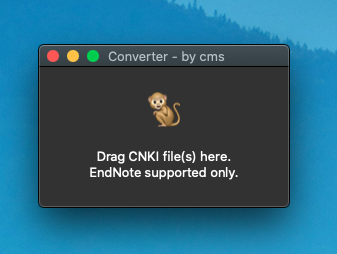

# CNKI 知网引文格式转换器

[View English version of this document.](./README_en.md)

将从知网下载的 EndNote 格式的引文文件转换为 RefMan 格式的引文，可以直接导入到 Mendeley 软件（一款 macOS 上免费的引文管理工具）和其他大部分的同类软件中。

本软件可运行于 macOS, Linux 以及 Windows 系统。

## 下载

请到本项目的 releases 页面下载最新的适合自己操作系统的文件。

## 用法

将 EndNote 格式引文文件拖拽到软件的窗口内，即可自动开始转换。转换成功后，软件会在原 EndNote 文件所在文件夹生成新的 .ris 格式的 RefMan 引文文件。

## 截图

## 开发

需要配置一些必要的环境变量。
